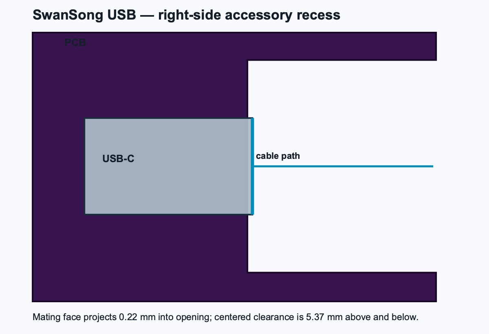

# SwanSong USB Rev B

SwanSong USB is a turnkey USB-C gamepad conversion of the published SwanTroller
PCB. It preserves the board outline, mounting holes, membrane contacts, and
button layout while replacing the plug-in controller module with a native-USB
PIC16F1459 SOIC circuit that MacroFab can source, program, and assemble.



## Manufacturing summary

- Two-layer PCB, bottom-side SMT assembly only
- 9 machine placements, 7 unique BOM lines
- USB-C receptacle is assembled by MacroFab
- USB-C mating face is centered in the WonderSwan Color right-side accessory/
  headphone-adapter recess, with a deliberate 0.22 mm projection into the opening
- No customer-supplied parts and no hand soldering
- A normal USB-C data cable is the only external cable required
- Crystal-free full-speed USB; no oscillator or plug-in MCU board
- MacroFab Standard rules: 10 mil minimum plated drill, 5 mil trace/spacing,
  and a conservative 16 mil copper-to-route-centerline keepout
- Exposed VPP, PGC/B, and PGD/A factory-programming contacts

## Files for MacroFab

- `swansong-usb-gerbers.zip` — copper, mask, paste, silk, outline, and drills
- `swansong-usb.XYRS` — placement data in MacroFab format
- `swansong-usb-bom.csv` — manufacturer part numbers and designators
- `firmware/build/swansong-usb.hex` — development factory image
- `FACTORY_PROGRAMMING.md` — programming and functional-test instructions

The Gerbers and placement files are deterministically generated by
`source/generate_swansong_usb.py`. The preserved GPL-licensed SwanTroller RP2040
Gerbers used as the mechanical/routing base are included in
`source/base-gerbers`, so the repository does not depend on another local checkout.

## Regenerating the release

```sh
python3 -m venv .venv
.venv/bin/pip install -r requirements.txt
.venv/bin/python source/generate_swansong_usb.py
.venv/bin/python source/render_review.py
```

The generator validates same-layer copper clearance, net continuity, via
stitching, preserved top-copper conflicts, connector-body interference, and the
USB-C mating-face position before it writes the manufacturing package.

The reviewed Rev B board renders are in `review-renders/top-rev-b.png` and
`review-renders/bottom-rev-b.png` (the bottom render is mirrored as viewed from
the assembly side).

## Origin and license

This is a July 2026 modified version of Zwenergy's GPL-3.0
[SwanTroller](https://github.com/zwenergy/swantroller). See `NOTICE.md` and
`LICENSE`. Microchip-derived firmware files retain the notices in their headers.

## Release blocker

The engineering HEX uses Microchip's demo USB identity. Prototypes can be built
with it, but a Microchip-assigned PID or an owned VID/PID is required before the
board is sold as a product.
